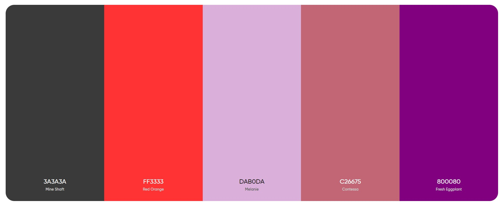

# Project Title
Panda Peace

## Overview
Panda Peace is a mental health awareness website created to provide resources, support, and encouragement to individuals struggling with mental health challenges. The site features a calming panda mascot and offers information on mental health topics, including Complex PTSD, alongside motivational quotes and tools to help users manage their well-being. Additionally, the site includes a "Quick Escape" feature for users who need to quickly leave the page for privacy reasons.

### Purpose
The purpose of Panda Peace is to offer a safe, welcoming space where users can access mental health resources and find comfort in knowing they are not alone. The site aims to break the stigma surrounding mental health by providing easy-to-understand information and encouraging individuals to seek help when needed. By raising awareness and offering a supportive environment, Panda Peace provides value to users by empowering them to take control of their mental health journey.

### Target Audience
The target audience for Panda Peace includes individuals experiencing mental health challenges, particularly those dealing with anxiety, depression, or trauma, including Complex PTSD. Additionally, the site caters to friends, family members, and caregivers who are seeking information to support their loved ones. This audience will benefit from the website’s resources, motivational content, and tools, as well as its user-friendly design and privacy-conscious features.

## User Stories

### Must-Have User Stories
User Story 1: As a user struggling with mental health, I want access to mental health information and support resources, so that I can find help and feel less isolated.

Acceptance Criteria: The site provides educational content on mental health topics, links to helplines, and motivational quotes.
User Story 2: As a user visiting the website in a sensitive situation, I want a “quick escape” button that allows me to leave the site quickly, so I feel safe while browsing.

Acceptance Criteria: A "Quick Escape" button is clearly visible on the site and redirects to a neutral page (e.g., Google) when clicked.

### Should-Have User Stories
User Story 1: As a user, I want to be able to navigate the site easily on any device, so that I can access the resources no matter where I am.

Acceptance Criteria: The site has a fully responsive design and works across various screen sizes and devices.
User Story 2: As a user interested in Complex PTSD, I want to find detailed information about the condition, so I can better understand its effects and seek help.

Acceptance Criteria: A section on Complex PTSD provides detailed information, symptoms, and links to resources.

### Could-Have User Stories
Could-Have User Stories
User Story 1: As a user, I would like to have a chat feature that connects me with mental health support groups or professionals.
Acceptance Criteria: The site includes a chat feature linked to mental health professionals or support networks.

User Story 2: As a user, I want to have a personal account where I can save articles and resources to read later.
Acceptance Criteria: Users can create an account and save content to their profile for later access.

## Design Decisions

### Colour Scheme
I decided to go for a fairly basic colour scheme as I didn't want to overcomplicate the site as it is meant to be a serious subject. 

- Used `#ff3333` and `#ff4d4d` for the exit button as I needed that to be visually obvious and bright
- Used `#800080;` for my card titles to make them stand out, my footer icons to also make them stand out and as the colour for when you hover over the navbar elements
- Used `#dab0da` for my jumbotron background to make it stand out and `#800080` for my jumbotron text to also make it stand out
- Used `#c26675` for my additional links as I wanted a nice colour

 Used Coolers to showcase my colour palette
 

### Typography
I used googlefonts to find a font I liked, I used the font "Lexend" as I liked the way it looked. 
I used font awesome for my icons as that's what I had used in previous projects. 

- [Google Fonts](https://fonts.google.com/) was used for all the text on my site. 

- [Font Awesome](https://fontawesome.com) was used for the icons in my footer.

### Wireframes

I just did very basic wireframes using Figma as I wasn't sure where I wanted to go in regards to colours etc, I did develop wireframes for both desktop and mobile. 
 
 ### Tools and Technologies Used 
 - [HTML](https://en.wikipedia.org/wiki/HTML) used for the main content
 - [Bootstrap](https://getbootstrap.com/) used for majority of design and layout
 - [CSS](https://en.wikipedia.org/wiki/CSS) for addtional styling, paired with bootstrap
 - [JavaScript](https://en.wikipedia.org/wiki/JavaScript) for my quick escape button as that needed JavaScript to function 
 - [Figma](https://www.figma.com/) for my wireframes 
 - [Google Fonts](https://fonts.google.com/) For my font 
 - [Font Awesome](https://fontawesome.com) For my icons
 - [CatalystStuff](https://www.freepik.com/author/catalyststuff) for my panda images 
 - [Pixabay](https://pixabay.com/illustrations/depression-fear-lonely-anxious-7065513/) for my complex PTSD image

### Accessibility Considerations
Accessibility was a key focus when designing Panda Peace. The site adheres to WCAG guidelines, ensuring all images have appropriate alt text and that there is sufficient colour contrast for readability. Additionally, the use of clear headings and simple language ensures the site is accessible to a broad audience.

## AI Tools Usage
I used ChatGPT to write the text on the site. 

## Features Implementation

Core Features (Must-Haves)
Quick Escape Button: A visible button that allows users to quickly exit the site by redirecting them to a neutral page (Google). This feature enhances user privacy and safety.
Mental Health Resources: Informative articles on mental health topics, such as Complex PTSD, and links to support services, including helplines and mental health organizations.

### Optional Features (Could-Haves)
Responsive Design: The site was designed with mobile-first principles, ensuring it is fully responsive and works seamlessly across different devices and screen sizes.
Complex PTSD Section: A dedicated section providing in-depth information about Complex PTSD, its symptoms, and available resources for those affected by prolonged trauma.

## Testing and Validation
Testing was conducted across multiple devices and browsers using Chrome DevTools to ensure the site’s responsiveness and usability. Minor issues with button alignment on mobile devices were identified and resolved.

### Validation
Both the HTML and CSS code were validated using the W3C and Jigsaw validators. All major errors were addressed, and warnings were resolved, ensuring the site meets web standards for accessibility and performance. I also checked with chatgpt as well to ensure there were no errors. 

### GitHub Copilot
Brief reflection on the effectiveness of using AI tools for debugging and validation.  
**Guidance:** Reflect on how GitHub Copilot assisted with debugging and validation, particularly any issues it helped resolve.

## Deployment

### Deployment Process
The deployment process was carried out using GitHub Pages. The main challenge encountered was ensuring the site rendered properly on mobile devices post-deployment, which was resolved by adjusting media queries.

### Reflection
### Successes
Effective use of GitHub Copilot to streamline coding and debugging tasks.
Successful integration of the Quick Escape function, enhancing the website's privacy features.
### Challenges
One of the challenges was ensuring consistency across different screen sizes, particularly with button placement and image scaling, which required additional testing and refinement. I also had a hard time making the navbar, it just wouldn't work for me. 

### Final Thoughts
Provide any additional insights gained during the project and thoughts on the overall process.  
**Guidance:** Begin drafting reflections during Phase 1 and update throughout the project. Finalize this section after Phase 4. Highlight successes and challenges, particularly regarding the use of AI tools, and provide overall insights into the project.

## Code Attribution
I used https://getbootstrap.com/ for the bootstrap elements, I also used ChatGPT to help me write the javascript portion of the site as I haven't learnt javascript yet.

## Future Improvements
In future I could add: 
User Accounts: Adding a feature for users to create accounts and save articles or resources for future reference.
Chat Functionality: Implementing a chat feature that connects users with mental health professionals or support groups.

## Credits
All assets below were used to create this website.
- [Bootstrap](https://getbootstrap.com/) Used for bootstrap elements to ensure they worked properly
- [W3C](https://validator.w3.org/) Used to check my code 
- [ChatGPT](https://chatgpt.com/) To generate my JavaScript code as I hadn't used it before 
 - [Figma](https://www.figma.com/) for my wireframes 
 - [Google Fonts](https://fonts.google.com/) For my font 
 - [Font Awesome](https://fontawesome.com) For my icons
 - [CatalystStuff](https://www.freepik.com/author/catalyststuff) for my panda images 
 - [Pixabay](https://pixabay.com/illustrations/depression-fear-lonely-anxious-7065513/) for my complex PTSD image

 ## Acknowledgements 
 - A big thank you to [ShellyM](https://github.com/shellym96) and the Code Institute team for all your support and guidance. Your advice has been super helpful in this journey, and I appreciate everything you’ve done!
 - Thank you as always to Matthew on my team for the guidance and advice